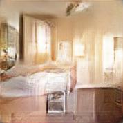
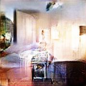

Overview
=

This repo contains the final state of a small project of mine where the goal was to use a [DCGAN](https://arxiv.org/pdf/1511.06434.pdf) to generate larger LSUN bedroom images (178x178) than in the paper (64x64) without sacrificing too much image clarity and without changing the methodology too much. It also contains a demo script and a trained generator so that a sense of the results of this project can be gathered easily.  

The data used was the LSUN dataset. The goal, like one of the goals in the paper linked above, was to generate fake bedroom images. The LSUN dataset contains images of around 20 different types of rooms or outdoor settings, in the DCGAN paper, only bedrooms were used. Here, I used the entire dataset, training the discriminator to correctly identify whether a given was generated by the generator or not, and if not, to identify which LSUN class it belonged to. This inclusion of training data that's used as an example of what to avoid makes this generator/discriminator pair an auxillary GAN. The auxillary GAN seems to have been a somewhat mixed bag, introducing some small features in images that look quite realistic, at the cost of some images clearly resembling types of rooms that they shouldn't. 

I changed the architecture as well. In the DCGAN paper, convolutional filters of constant size were used. Here, I made the filter size increase with layer depth. 

Demo
=

Since most of this repo is just a collection of model-training code for my own use, it isn't especially well-organized or documented. Therefore I have included a demo script and a sample trained generator. Aside from the necessary model location and image output directory arguments, the argument most noteworthy is the -w argument, which determines whether the demo will generate images randomly (i.e. with random sampling from the latent space of the generator) or whether the demo will pick a single random point in the generator latent space, a single random step vector in the latent space, and perform a walk in the latent space from the starting point with increment equal to the value of the -w argument times the step vector. The generator was trained with sampling in the latent space in the unit interval in each coordinate, therefore any increment that leaves the unit interval will be clipped to either 0 or 1 accordingly (in other words, if a step causes the next latent space point to be outside the unit hypercube, it is replaced with a point with too large or small coordinates clipped appropriately, thus we are not really walking in the direction of the chosen step vector, but only along it so long as we are able, and deviating only so much as we have to to stay in the unit hypercube). Note that this implies that if the step size is too large, most of the images generated will look pretty much the same. And, of course, the same will be true if it is too small! 

Type `python demo.py -h` to see more completely how to use it. 

As an example, if in this repo I type `mkdir images` followed by `python demo.py generator.pt images -n 50 -w 0.05 -s 0` I get 50 images in the new directory that comprise a pretty smooth deformation from the image on the left to the image on the right. You will, of course, need PyTorch installed, and also PIL. I've included the output of this command in the folder sample-output in case you don't have one of those.   

 
 
 Here we see a change in room lighting, as well as what appears to be part of a bed morphing into some sort of dresser drawer or cabinet. As expected of a latent space walk in a good semantic representation, these changes are gradual and have a meaning intelligible to us. As an interesting side note, the generator appears to be trying to make this particular floor very reflective. I don't have a clue why. 
